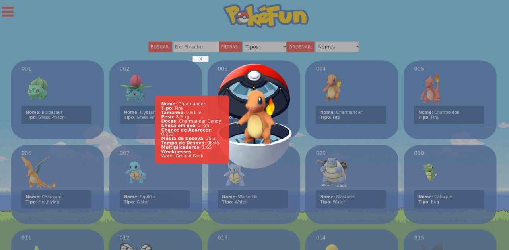
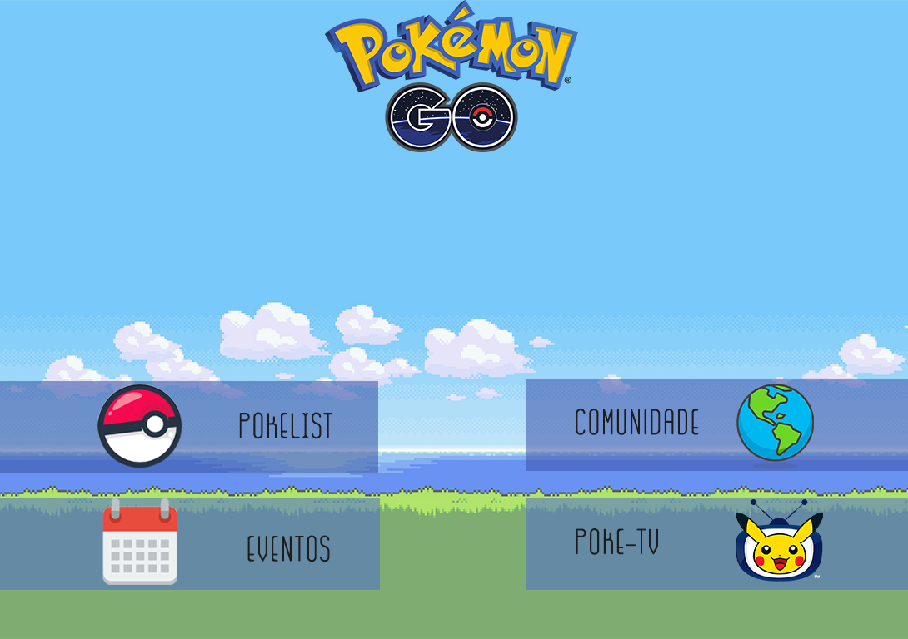
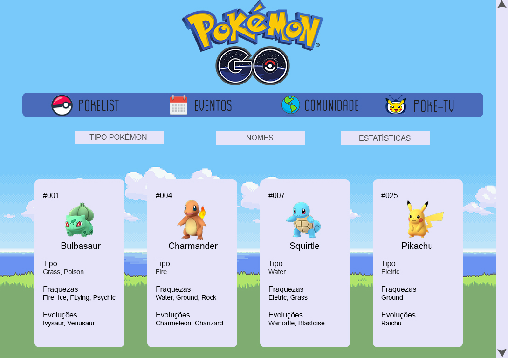

Pode visualizar e testar nossa página neste link:https://karina1981.github.io/SAP004-data-lovers/index.html

## Índice 

- [1. PokéFun](#1-pokefun)
- [2. História de Usuários](#2-historias-de-usuario)
- [3. Desenho de Interface](#3-desenho-de-interface)
- [4. Teste-de-Usabilidade](#4-teste-de-usabilidade)
- [5. Autoria e Considerações Finais](#5-autoria-e-consideracoes-finais)

---

## 1. PokéFun 

Pokémon GO é um jogo eletrônico free-to-play de realidade aumentada voltado para smartphones. O jogo é desenvolvido entre a Niantic, Inc., a Nintendo e a The Pokémon Company para as plataformas iOS e Android. O jogo foi lançado em 2016 e oferece uma experiência de se tornar um mestre Pokémon. 
É possível caçar, evoluir, e batalhar com seus Pokémon.
No projeto Data Lovers, misturamos referências do mundo Pokémon com o jogo. 
Escolhemos Pokémon Go por ser um jogo mundialmente conhecido, sendo assim, poderiamos de certa forma contribuir com a experiência do usuário.

## 2. Histórias de Usuário 

Em nossa primeira pesquisa, selecionamos as principais necessidades do usuário. Entre elas, visualizar as fraquezas de cada Pokémon.  
Percebemos algumas outras necessidades, como por exemplo, relembrar a série que deu origem ao jogo. Sendo assim, decidimos criar uma página que contém os links para todas as temporadas da série, a nossa Poké-TV.

<b>Criamos uma interface que permite:</b>

<li>Visualizar todos os Pokémon da Primeira Geração.</li> 
<li>Visualizar todas as informações importantes de um Pokémon, como seu tipo, fraqueza, quantidade de doces, entre outros.</li>  
<li>Buscar um Pokémon por nome.</li>  
<li>Ordenar os Pokémon por ordem alfabética.</li> 
<li>Visualizar quais Pokémon são de cada tipo.</li> 
<li>Encontrar os links para assistir todas as temporadas de Pokémon.</li>  

A PokéFun contém duas páginas que estão em construção, a Eventos e Comunidade. Em Evento, o usuário poderá se informar sobre os eventos do jogo e em Comunidade poderão visualizar grupos de jogadores por todo mundo.

## 3. Desenho de Interface 

<b>Protótipo de baixa fidelidade - Papel</b>

Primeiro, fizemos o protótio de baixa fidelidade, no papel. Nele, desenhamos as páginas que gostaríamos de fazer. Chegamos a conclusão que seria interessante ter uma Home, para informar o usuário sobre cada página. 

  
  

 <b>Protótipo de média fidelidade - Photoshop</b>

Posteriormente, fizemos o teste de média fidelidade no Photoshop, já com a proposta de interface mais fiel a que gostaríamos de desenvolver.  

  
  

## 4. Teste de Usabilidade 
Durante a criação do projeto fizemos teste de usabilidade com os usuários. No teste, o principal problema detectado foi a falta de um botão para voltar para a Home ou ir para as outras páginas. Assim, decidimos criar o menu hamburger. 

## 5. Autoria e Considerações Finais 
Esse projeto foi desenvolvido em dupla por Jessica Brunhara e Karina Pereira como parte do bootcamp < Laboratoria >. Foi um grande desafio que trouxe um grande aprendizado!
